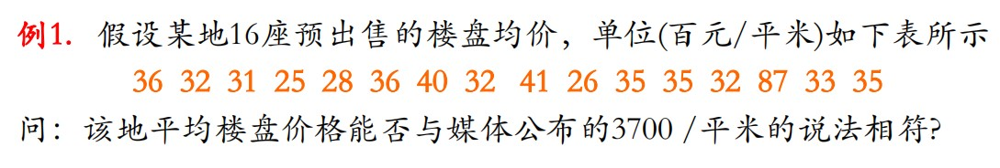
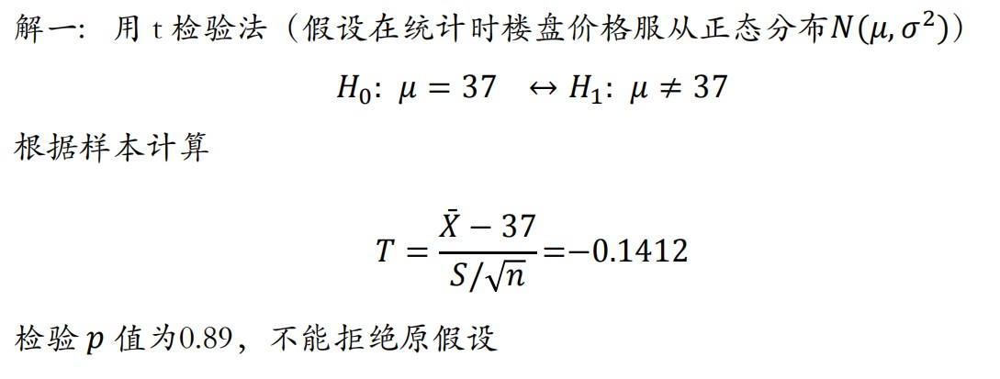

# 1 序言

> 第二次接触非参数统计这门课程，老师非常快速地过了经典非参数统计的主要框架。以下内容力争加入对非参数统计方法的思考，并简要整理出使用指南。

## 1.1 两个思考

1. 何为统计？

- 统计包括对数据的收集、整理、分析和推断。
- 统计是基于数据的学科，其数学基础是概率论，概率论是讨论随机性的学科。
- 数学可以是一个独立存在的逻辑体系，而统计离开了应用就没有存在的必要。
- 统计分析的思路主要有以下两种：
  - 先知道问题和解决的思路，后设计实验或调查方案去收集所需的数据，数据获取后经过预处理按照预期设想进行应用；
  - 先获取数据，根据目标问题和数据的特点建立模型，建模后进行推断。
- 在统计中不存在完美的模型，任何由数据归纳出来的模型往往要回到实际中对其检验，并用新的数据对之进行修正（贝叶斯视角）。

2. 何为参数统计和非参数统计？

- 参数统计
  - 产生数据的总体分布形式（或分布族）已经假定，只需对有限个未知参数进行统计推断，研究的是精确分布；
  - 典型的参数统计问题：极大似然估计、正态分布的假设检验问题；
  - 局限性：总体分布的假定缺乏依据；样本可能不是来自具有假定分布的总体；样本数据可能存在系统误差；
  - 优势：当总体分布已知时，参数统计方法更有针对性，更有效；

- 非参数统计
  - 对总体分布形式无假定，或仅作如对称性、连续性的一般性假设条件，主要研究的是$n\rightarrow\infty$的极限分布；
  -  优势：假定较少，因此有更广泛的适用性和更稳健的结果；
  -  局限性：当总体分布已知时，非参数统计方法低效；

- 注意两者的划分不是绝对的。

## 1.2 非参数统计怎么做

- 分布的估计
- 密度的估计
- 次序统计量
- 秩

## 1.3 假设检验

### 1.3.1 原假设怎么选

### 1.3.2 检验统计量怎么选

# 2 单样本问题

## 2.1 问题引入

考虑一个简单的假设检验问题

传统地，我们会使用独立样本T检验法，注意**T检验法的前提是做了假设，即在统计时楼盘价格服从正态分布$N\sim\left(\mu,\sigma^2\right)$**。

依据T检验法的步骤，我们可以很容易地得到

可知，运用T检验法得到的结论是不能拒绝原假设，即平均价格是3700。

现在，重新回去看数据，发现16个数字中仅有3个数字大于3700，特别地，还有1个8700的极端数字。明显地，所收集的数据无法支持3700是正态分布对称中心的观点。由此可知在这个例子中，运用T检验法是不妥的，因为其所需的正态假定是不合理的。

下面考虑放开正态假定，使用非参数统计的方法进行假设检验。

## 2.2 符号检验

顾名思义，符号检验就是通过符号$+$和$-$的个数来做统计推断。

### 2.2.1 基本原理

- 基本思想：用总体中位数Me表示中间位置，样本大于Me的概率与小于Me的概率应该相等。